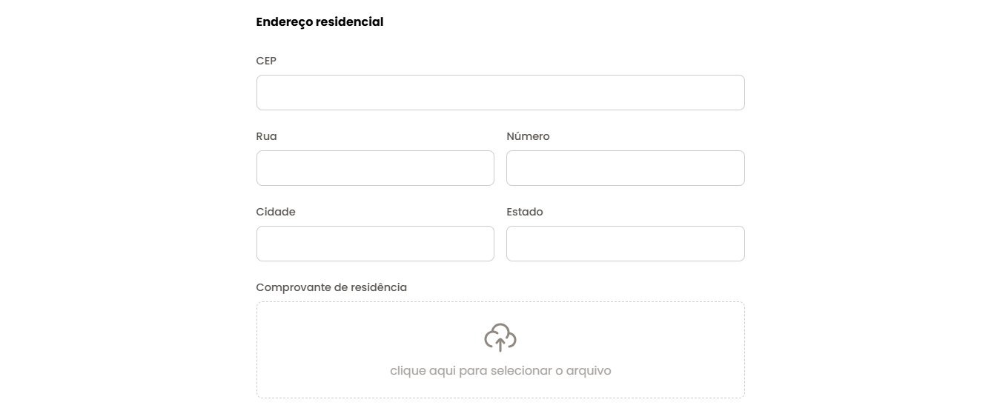
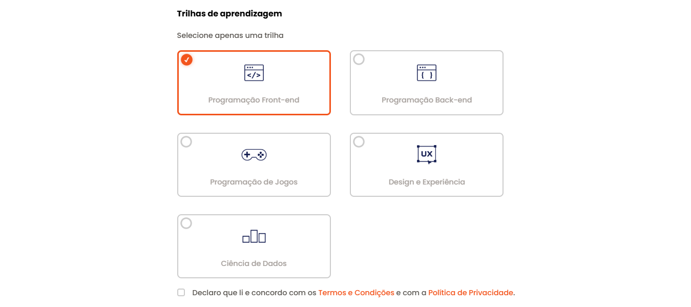
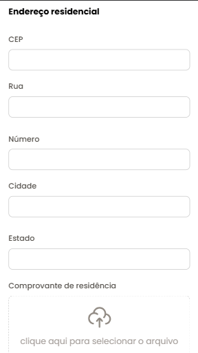
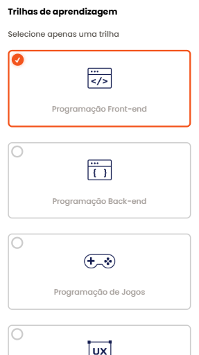

# 📝 Formulário de Inscrição - Trilhas Inova

Sistema de inscrição para o programa Trilhas Inova (SECTI + FAPEMA) com validações em tempo real, design responsivo e fluxo intuitivo.

## ✨ Funcionalidades Principais
- **Validação inteligente** de CPF, e-mail, telefone e datas
- **Upload de documentos** com preview interativo
- **Seleção de trilhas** com cards clicáveis
- **Animações suaves** (fade-in/fade-out) entre páginas
- **Design responsivo** para todos os dispositivos
- **Feedback visual** instantâneo para erros

## 🖥️ Preview
<!-- Adicione screenshots aqui -->

  ### Preview no computador ou notebook
Página de Login

Formulário

Formulário

  ### Preview no mobile
    
| Login | Formulário| Formulário|
|-------|-----------|-----------| 
|  |  |   |

## 🛠️ Tecnologias Utilizadas
- **HTML5**: Estrutura semântica
- **CSS3**: Grid, Flexbox e animações
- **JavaScript**: Validações com Regex
- **Google Fonts**: Fonte Poppins
- **Git/GitHub**: Versionamento e hospedagem

## 📚 Documentação Completa

Na documentação, será possível encontrar as seguintes informações:
- ✅ Lista de requisitos funcionais
- 🚧 Roadmap de desenvolvimento
- 🔍 Metodologias de validação
- 🗺️ Fluxograma do cadastro

## 🔮 Próximos Passos & Roadmap
| Status | Feature                    | Descrição                          |
|--------|----------------------------|------------------------------------|
| 🔜     | API de CEP                 | Autocompletar endereço via CEP     |
| ⏳     | Confirmação por E-mail     | Envio automático de confirmação    |
| 🛠️    | Painel Administrativo      | Dashboard de gestão de inscritos   |
| 💡     | Login Social               | Acesso via Google/LinkedIn         |

## 📞 Contato dos Desenvolvedores

### Gabriel Patrick

### Eduardo Oliveira

